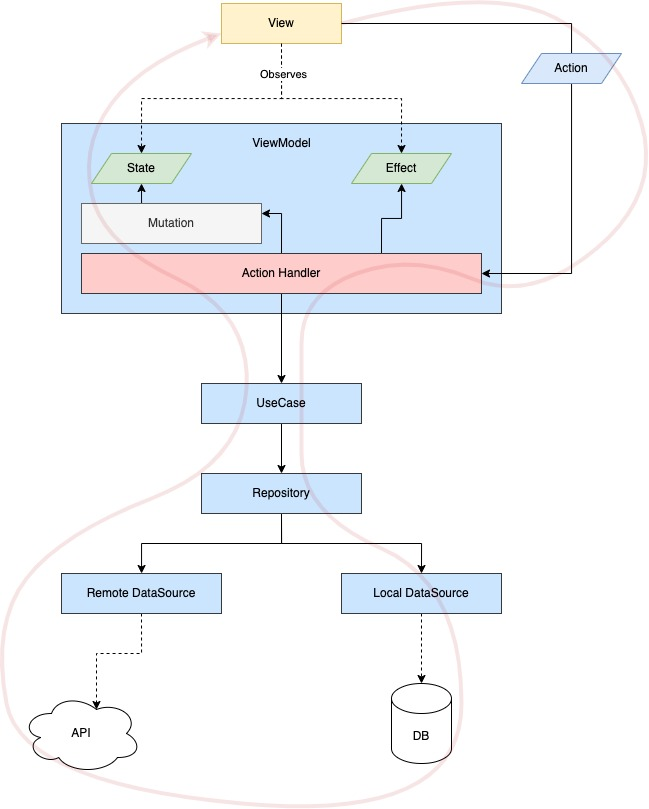
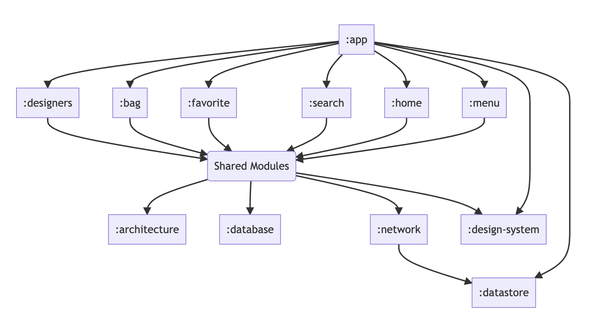

# BambiniFashion
This app is the code challenge of [BambiniFashion](https://bambinifashion). It displays the home feed screen with caching and live promotion text.

## Let's talk about the details
I decided to imagine that this is a peace of scalable app so I choose to use my best at modularity, architecture, and build time optimization aspects.

Here are all the technology and third-party libraries that I used in the project. I put some explanation about each of them on its side.

- ### Clean architecture
  Unlike the traditional DDD pattern, a bad implementation of the clean architecture is not scalable for android projects regarding the build time bottleneck. so I decided to optimize it and move the data and domain inside each feature to make them completely independent and also capable to share the required codebase with others.

- ### Gradle optimization
  I enabled the `configuration-cache`, `build-cache` and `parallelism` in gradle to make it able to finish the compilation faster than before.

- ### MVI architecture
  Providing an easy-to-use and scalable MVI architecture is a little annoying, so I created a complete architectural codebase that makes it easy and customizable.
  Here is the architecture diagram.

- ### Kotlin + Flow
- ### Coroutines
- ### Shared Preferences
- ### Hilt
- ### Picasso
- ### Retrofit + Moshi(Codegen)
- ### BottomNavigationView
- ### Room
- ### Version Catalogs
- ### Custom Gradle Plugin(via Composite Builds)
- ### Custom Multi-Row RecyclerView Adapter
- ### Central `design-system`(shared UI components)

## Modules Graph
Having well architecture modules dependency graph will help the developers to optimize the project builds. and optimize the connection between the modules.

